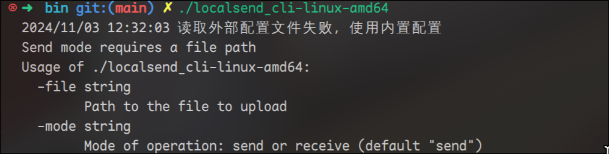
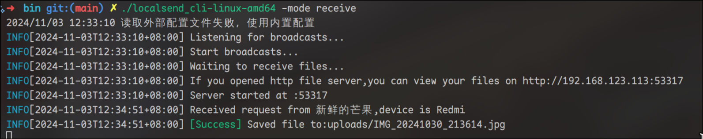

<div align="center">
<h1>LocalSend CLI</h1>
  
  <p>✨LocalSend CLI✨</p>
</div>

## 文档 | Document

[中文](doc/README_zh.md) | [EN](doc/README_en.md) | [日本語](doc/README_ja.md)

## 安装

> 😊可以下载Release中的可执行文件,找到你对应的平台即可

### 先决条件

- [Go](https://golang.org/dl/) 1.16 或更高版本

### 克隆仓库

```sh
git clone https://github.com/meowrain/localsend_cli.git
cd localsend_cli
```

### 编译

使用 `Makefile` 来编译程序。

```sh
make build
```

这将会为所有支持的平台生成二进制文件，并保存在 `bin` 目录中。

## 使用

### 使用帮助



### 运行程序

#### 接收模式

```sh
.\localsend_cli-windows-amd64.exe -mode receive
```




根据你的操作系统和架构选择相应的二进制文件运行。
Linux下需要执行这个命令，启用其ping功能
`sudo setcap cap_net_raw=+ep localsend_cli`

#### 发送模式

```
.\localsend_cli-windows-amd64.exe -mode send -file ./xxxx.xx
```

例子:

```
.\localsend_cli-windows-amd64.exe -mode send -file ./hello.tar.gz
```


> 你可以使用j,k或者上下按键进行上下移动，q退出，enter确认

## 贡献

欢迎提交 issue 和 pull request 来帮助改进这个项目。

## 许可证

[MIT](LICENSE)

# Todo

- [x] 发送功能完善 发送文字可以在设备上直接显示
- [ ] tui刷新问题 
- [ ] i18n