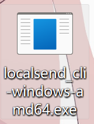
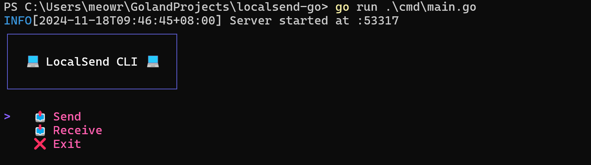

<div align="center">
    <h1>LocalSend Go</h1>
    <h4>✨CLI for localsend implemented in Go✨</h4>
    
    <br>
    
</div>

## Documentation

[中文](doc/README_zh.md) | [EN](doc/README_en.md) | [日本語](doc/README_jp.md)

Currently divided into version v1.1.0 and v1.2.0. For version v1.1.0 documentation, see [Localsend-Go-Version-1.1.0 doc](version1.1.0/).

The following documentation is for version v1.2.0.

## Installation

### Arch Linux

```bash
yay -Syy
yay -S localsend-go
```

> 😊 Alternatively, download the executable file from the Release section. Find the one for your platform.

### Prerequisites

- [Go](https://golang.org/dl/) 1.16 or later

### Clone the Repository

```sh
git clone https://github.com/meowrain/localsend_cli.git
cd localsend_cli
```

### Build

Use the `Makefile` to build the program.

```sh
make build
```

This will generate binaries for all supported platforms and store them in the `bin` directory.

## Usage

### Run the Program

On Windows, you can directly double-click the executable.



Or run:

```sh
.\localsend_cli-windows-amd64.exe
```



Simply use the keyboard to select the desired mode, and the corresponding mode will automatically start.


> In Receive Mode, please use `Ctrl + C` to exit the program after receiving files. Do not close the window directly; on Windows, closing the window does not terminate the program.

Run the appropriate binary for your OS and architecture.

On Linux, enable the ping functionality by executing:

```sh
sudo setcap cap_net_raw=+ep localsend_cli
```

## Contributing

> Thanks to the contributors below for their support!

> <a href="https://github.com/meowrain/doc-for-sxau/graphs/contributors">
> 
> </a>

Feel free to submit issues and pull requests to help improve this project.

## License

[MIT](LICENSE)

## Todo

- [x] Improve send functionality: display sent text directly on the recipient device.
- [ ] Fix TUI refresh issues.
- [ ] Add internationalization (i18n).

## Star History

[](https://star-history.com/#meowrain/localsend-go&Date)
