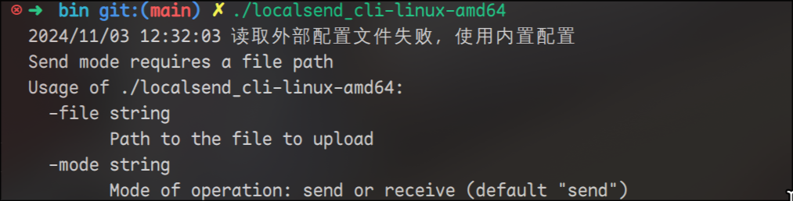
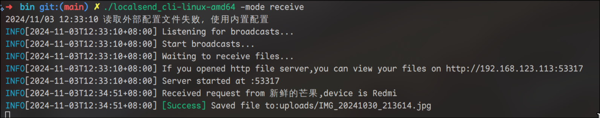
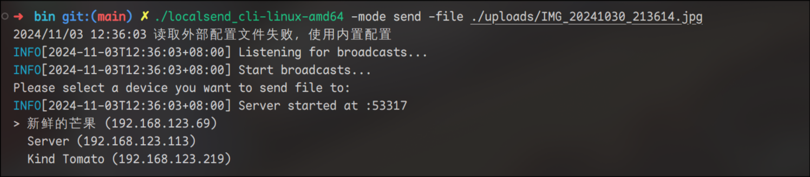
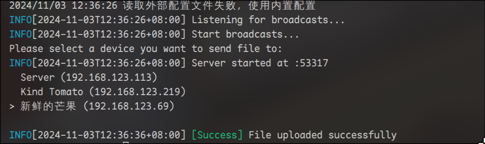

<div align="center">
<h1>LocalSend CLI</h1>
  
  <p>✨LocalSend CLI✨</p>
</div>

## Documentation

[中文](doc/README_zh.md) | [EN](doc/README_en.md)

## Installation

> 😊 You can download the executable file from the Release page and select the version for your platform.

### Prerequisites

- [Go](https://golang.org/dl/) 1.16 or higher

### Clone the Repository

```sh
git clone https://github.com/meowrain/localsend_cli.git
cd localsend_cli
```

### Build

Use the `Makefile` to compile the program.

```sh
make build
```

This will generate binary files for all supported platforms in the `bin` directory.

## Usage

### Help



### Run the Program

#### Receive Mode

```sh
.\localsend_cli-windows-amd64.exe -mode receive
```



Choose the binary file that matches your operating system and architecture.
On Linux, you need to run the following command to enable the ping feature:
`sudo setcap cap_net_raw=+ep localsend_cli`

#### Send Mode

```
.\localsend_cli-windows-amd64.exe -mode send -file ./xxxx.xx
```

Example:

```
.\localsend_cli-windows-amd64.exe -mode send -file ./hello.tar.gz
```




> You can use `j`, `k`, or arrow keys to navigate, `q` to quit, and `enter` to confirm.

## Contribution

Feel free to submit issues and pull requests to help improve this project.

## License

[MIT](LICENSE)

# Todo

- [x] Completed send feature: Text sent can display directly on the device.
- [ ] TUI refresh issue
- [ ] i18n