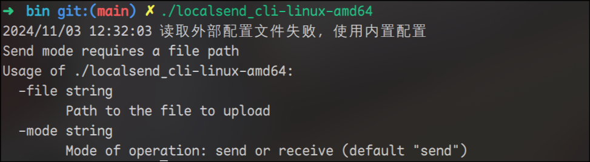

<div align="center">
<h1>LocalSend CLI</h1>
  
  <p>✨LocalSend CLI✨</p>
</div>

## Installation

> 😊 You can download the executable files from the Releases.

### Prerequisites

- [Go](https://golang.org/dl/) 1.16 or higher

### Clone the Repository

```sh
git clone https://github.com/meowrain/localsend_cli.git
cd localsend_cli
```

### Build

Use the `Makefile` to build the program.

```sh
make build
```

This will generate binary files for all supported platforms and save them in the `bin` directory.

## Usage

### Run the Program

#### Receive Mode

```sh
.\localsend_cli-windows-amd64.exe -mode receive
```

Choose the appropriate binary file for your operating system and architecture.
On Linux, you need to execute this command to enable its ping functionality:
`sudo setcap cap_net_raw=+ep localsend_cli`

#### Send Mode

```sh
.\localsend_cli-windows-amd64.exe -mode send -file ./xxxx.xx -to your_ip
```

Example:

```sh
.\localsend_cli-windows-amd64.exe -mode send -file ./hello.tar.gz -to 192.168.3.199
```

## Contribution

You are welcome to submit issues and pull requests to help improve this project.

## License

[MIT](LICENSE)

# Todo

- [ ] Improve send functionality to display sent text directly on the device

